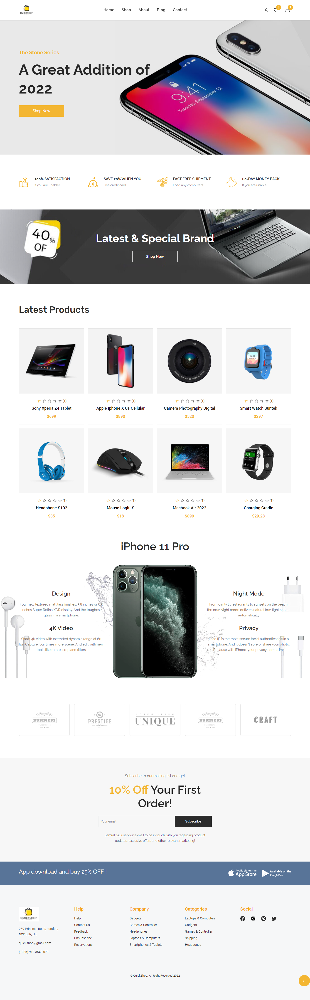
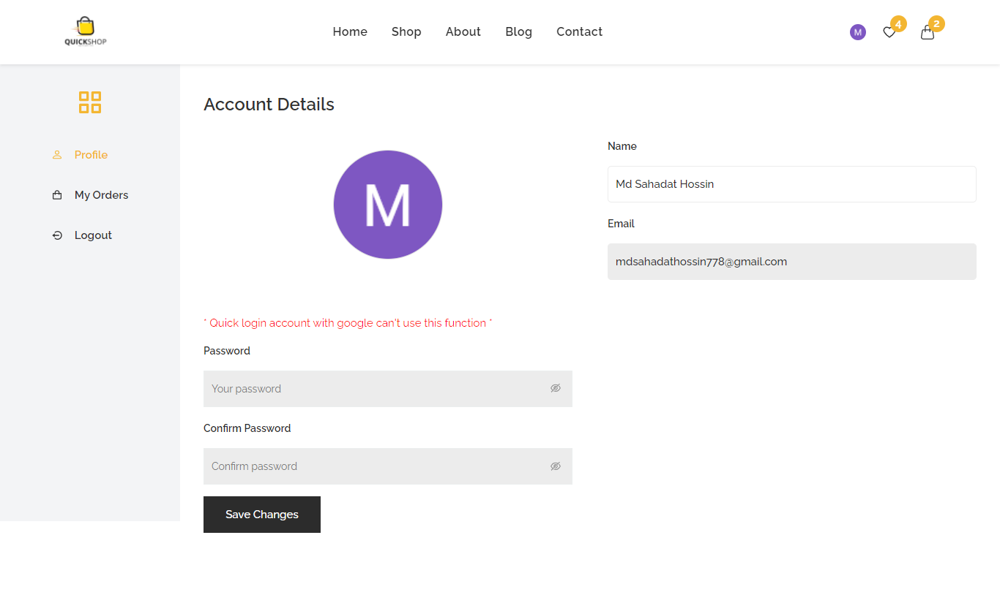
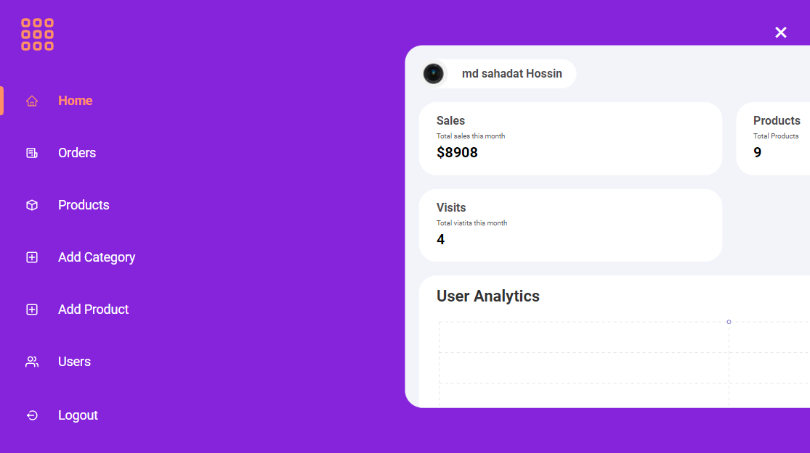

# Mern-Quickshop-Ecommerce-website using React + Redux + Sass + Node js + express js + Mongodb, Stripe payment gateway etc.

- Register, login with validation
- Quick login with Google
- For authentication used google OAuth
- Forgot password, reset password and register a new account by Email verification.
- Update user information (name, password and avatar)
- Shopping cart functionality and wishlist funtionality
- Implemented stripe payment gateway
- Searching, filtering, Sorting and Pagination on shop page
- User can add review dynamically after login
- User dashboard - user can see the all orders and update her profile also
- Have different admin panel
- Amin can manage all orders, update orders, delete any orders, add new product, update product, delete product, add new category, update category, delete category, manage all users, update user, delete user and can see total sales, all products much more
- Admin can update her profile, admin can manage the user reviews
- Responsive for all devices like mobile, tablet, laptop, desktop etc
- Fronted: React js, Reudx, Sass, React-bootstrap, React-router-dom, recharts etc
- Backend: Node js, Express js, Mongodb, JSON web token, Mongoose, Google OAuth, Nodemailer, Stripe, cloudinary etc...

# Here is the main Website Live link - (https://mern-quickshop-app-ecommerce.herokuapp.com/)

# Here is the Admin Panel Live Link - (https://mern-quickshop-admin-panel.herokuapp.com/)

# Website Interface -

# User Dashboard interface -

# Admin Dashboard interface -

